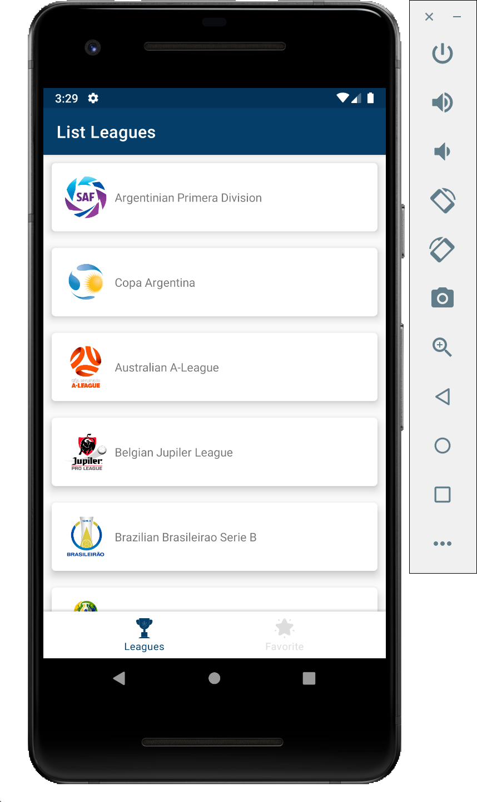
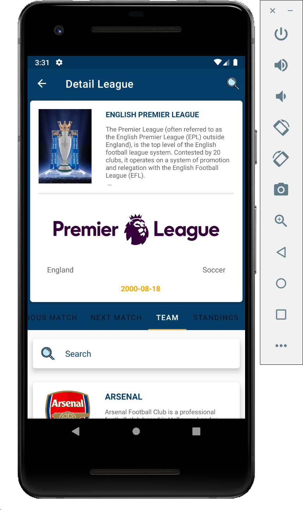
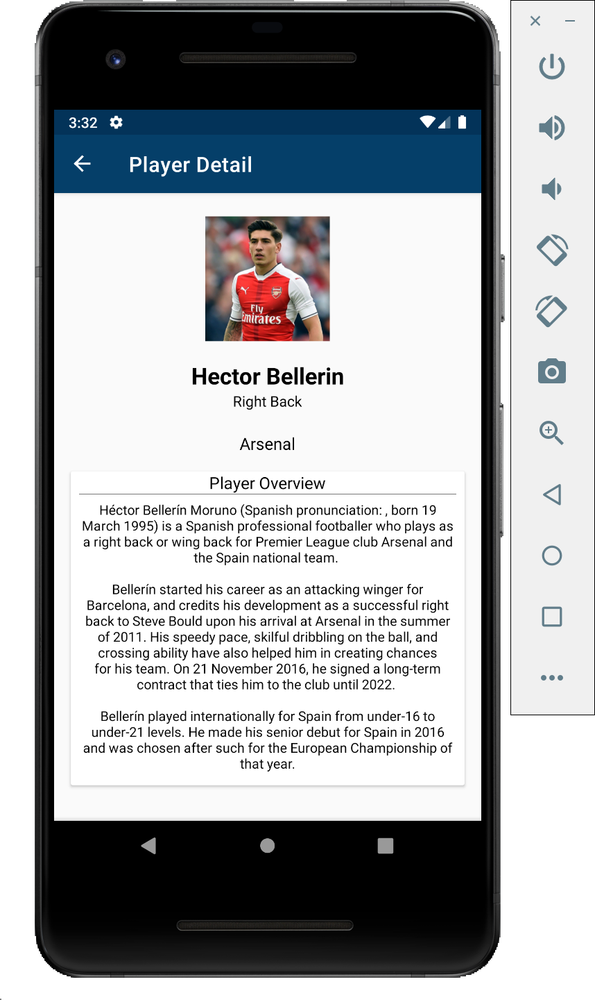
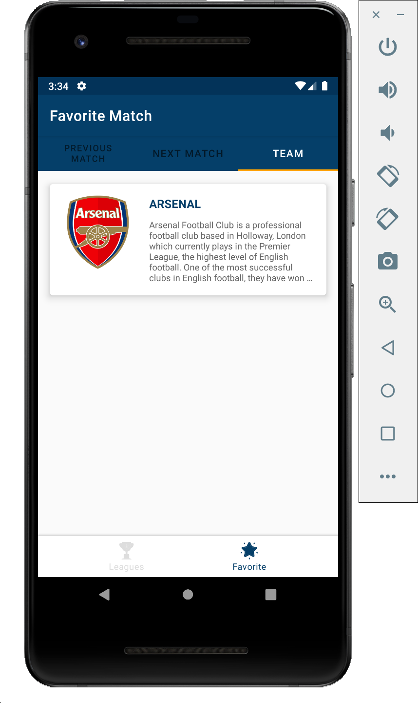

# Football Match

All submission KADE (Kotlin Android Developer Expert) class from <a href="https://www.dicoding.com/academies/55">dicoding</a> 

This repo using API from <a href="https://www.thesportsdb.com/">The Sport DB</a>

## Screenshot

<pre>
                    
</pre>

### Branch master (Submission 1)
#### Tech

* [x] Anko Layouts

### Branch submission-2 (Submission 2)
#### Tech

* [x] Jetpack Component (Data Binding, Lifecycles, Live Data, Navigation, View Model)
* [x] Repository Pattern
* [x] RxJava
* [x] Dagger2
* [x] Shimmer
* [x] Retrofit

### Branch submission-3 (Submission 3)
#### Tech

* [x] Jetpack Component (Data Binding, Lifecycles, Live Data, Navigation, View Model)
* [x] Repository Pattern
* [x] RxJava
* [x] Dagger2
* [x] Shimmer
* [x] Retrofit
* [x] Anko SQLite

### Branch submission-4 (Submission 4)
#### Tech

* [x] Jetpack Component (Data Binding, Lifecycles, Live Data, Navigation, View Model)
* [x] Repository Pattern
* [x] RxJava
* [x] Dagger2
* [x] Shimmer
* [x] Retrofit
* [x] Anko SQLite
* [x] Unit Testing (Mockito)
* [x] Instrumentation Test (Espresso Idling Resource)

### Branch submission-5 (Final Project)
#### Tech

* [x] Jetpack Component (Data Binding, Lifecycles, Live Data, Navigation, View Model)
* [x] Repository Pattern
* [x] RxJava
* [x] Dagger2
* [x] Shimmer
* [x] Retrofit
* [x] Anko SQLite
* [x] Unit Testing (Mockito)
* [x] Instrumentation Test (Espresso Idling Resource)

### Todo

* [ ] Publish to Play Store

## Author

* **R Rifa Fauzi Komara**

Jangan lupa untuk follow dan ★
